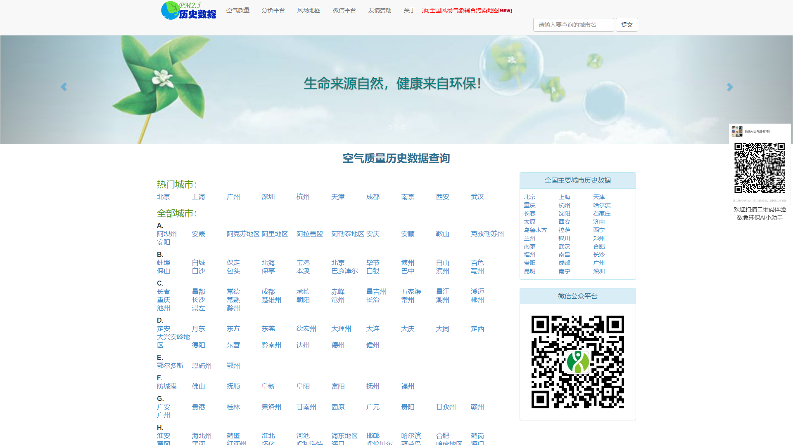
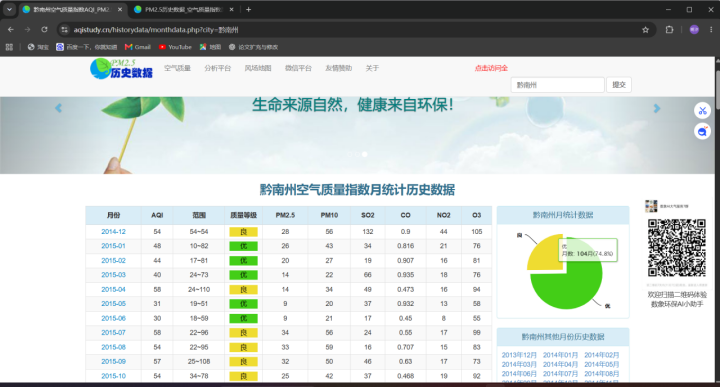

# 空气质量数据来源说明

## 1. 数据来源网站

本数据集采集自 **中国空气质量在线监测分析平台**（AQI Study），该平台汇总中国环境监测总站发布的全国城市空气质量实时及历史数据。

| 项目 | 说明 |
|------|------|
| 网站名称 | 中国空气质量在线监测分析平台 |
| 网址 | https://www.aqistudy.cn/historydata/ |
| 数据更新 | 每日更新 |
| 历史数据 | 自 2013 年 12 月起 |
| 覆盖范围 | 全国 389 个地级及以上城市 |

## 2. 数据采集方式

### 2.1 采集技术

- **采集工具**: Python 爬虫，基于 Playwright 浏览器自动化
- **反爬策略**: 该网站采用自定义 Base64 编码 + AES-128-CBC + DES-CBC 对称加密保护数据接口，数据在传输过程中经过多层加密
- **技术方案**: 通过 Playwright 无头浏览器加载网站原生 JavaScript 加解密函数，配合 Python requests 库发起 HTTP 请求，实现 API 数据的加密请求与解密响应

### 2.2 数据接口

- **API 端点**: `POST https://www.aqistudy.cn/historydata/api/historyapi.php`
- **请求参数**: `hA4Nse2cT`（AES 加密后的 Base64 编码字符串）
- **请求格式**: `application/x-www-form-urlencoded`
- **调用方法**: `GETDAYDATA`
- **参数**: `{"city": "城市名", "month": "YYYYMM"}`

### 2.3 爬虫代码位置

项目 `backend/` 目录下：
- `aqistudy_scraper.py` — 历史数据爬虫主脚本
- `cnemc_scraper.py` — 实时数据爬虫脚本（备用数据源：https://air.cnemc.cn:18007/）

## 3. 数据字段说明

原始数据共 11 个字段，各城市数据以独立 CSV 文件存储，文件名即为城市拼音：

| 字段名 | 含义 | 数据类型 | 示例 |
|--------|------|----------|------|
| 地区 | 城市名称（取自文件名） | 文本 | 北京 |
| 日期 | 观测日期 | YYYY-MM-DD | 2020-01-15 |
| 质量等级 | 空气质量等级 | 类别 | 优/良/轻度污染/中度污染/重度污染/严重污染 |
| AQI指数 | 空气质量指数 | 数值 | 73 |
| 当天AQI排名 | 全国城市AQI排名 | 数值 | 45 |
| PM2.5 | 细颗粒物浓度 (μg/m³) | 数值 | 42 |
| PM10 | 可吸入颗粒物浓度 (μg/m³) | 数值 | 56 |
| So2 | 二氧化硫浓度 (μg/m³) | 数值 | 4 |
| No2 | 二氧化氮浓度 (μg/m³) | 数值 | 15 |
| Co | 一氧化碳浓度 (mg/m³) | 数值 | 0.9 |
| O3 | 臭氧浓度 (μg/m³) | 数值 | 127 |

## 4. 数据质量说明

1. **原始性**: 数据直接从 aqistudy.cn 爬取，未经清洗，保留原始状态
2. **准确性**: 数据直接来自国家环境监测总站官方监测站点
3. **完整性**: 197 个城市文件中有 188 个包含有效数据（9 个文件为空），共 588,716 条日数据
4. **编码**: 大部分文件为 UTF-8 编码，少数（北京、重庆、天津）为 GBK 编码

## 5. 截图展示

### 网站首页

### 城市月度数据

### 每日详细数据

